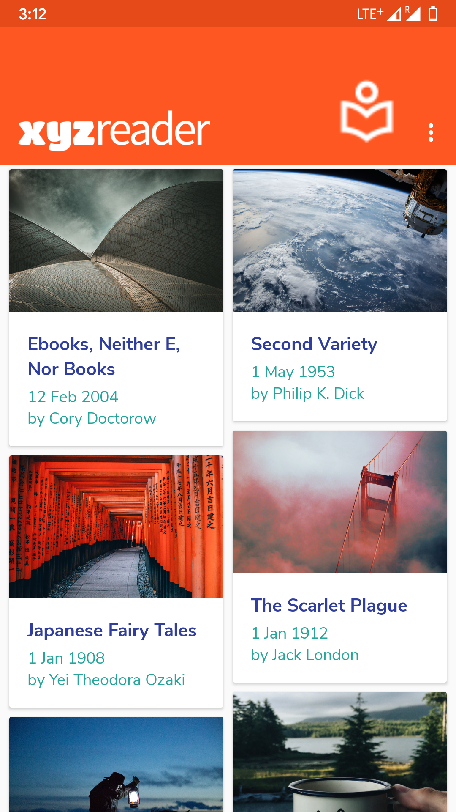
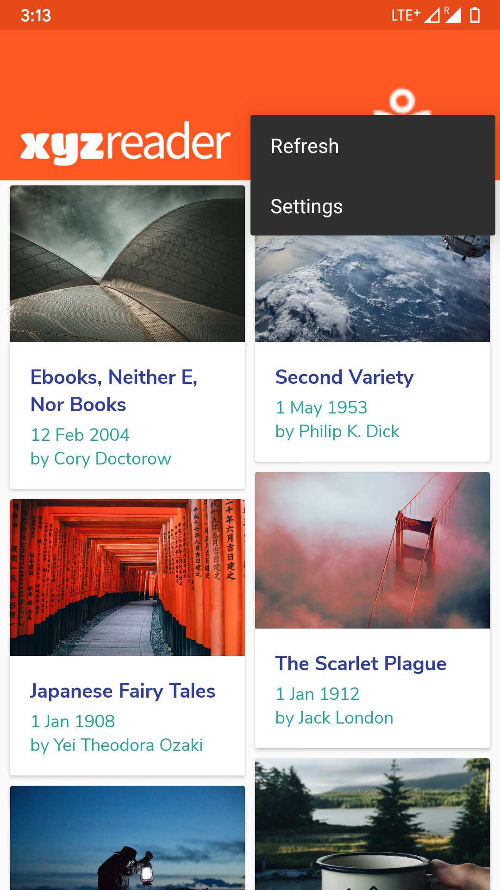
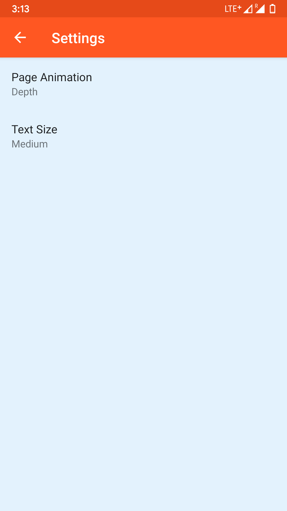
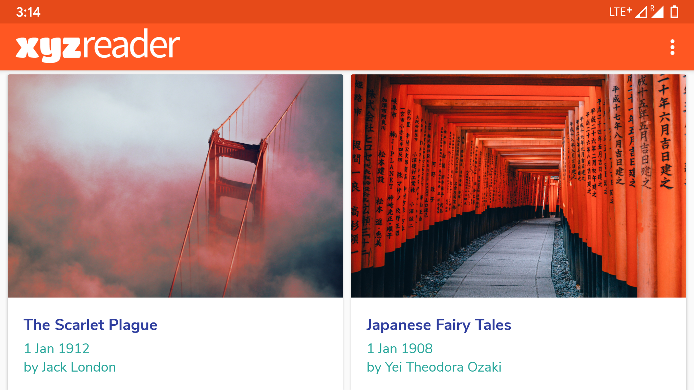
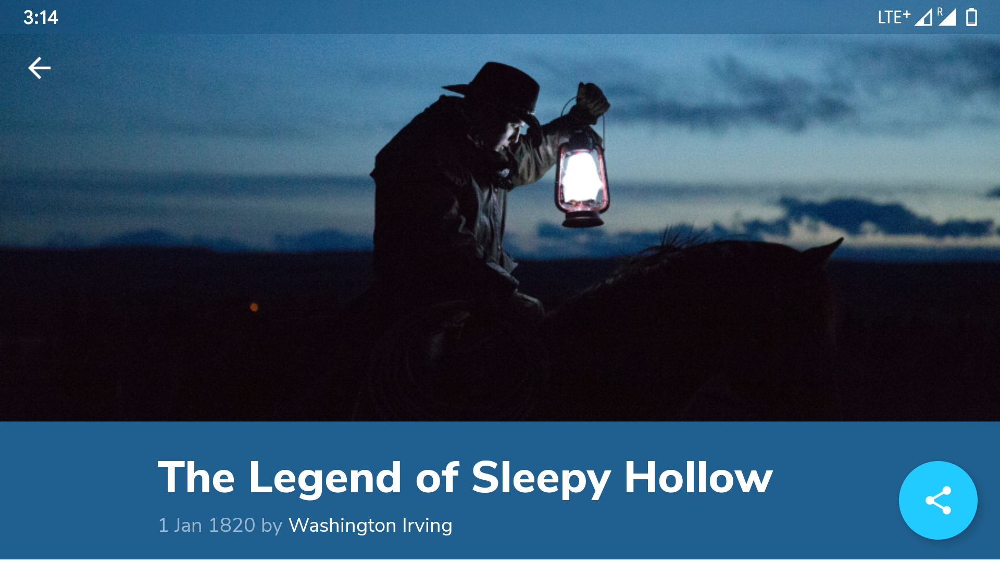

# XYZ Reader 

## Project Overview
In this project, you will redesign an app to follow the Material Design guidelines and translate a set of static design mocks to a living and breathing app.

## Why this Project?
This project gives you an opportunity to improve an app’s design, a vital skill for building apps users will love. It also replicates a common developer task of updating and changing an app's design as new standards are released.

## What Will I Learn?
Through this project, you will:

* Understand the fundamentals of Android design.
* Apply Material Design guidelines to an mobile application.
* Separate an interface into surfaces.
* Effectively use transitions and motion.

## Features
* Implement the Shared Element Transition
* Customize the animation using PageTransformer
* Show a Snackbar with a button that allows to perform an action
* Use CoordinatorLayout, CollapsingToolbarLayout
* Create a custom ThreeTwoImageView to make all the images have the same proportion

## Screenshot

